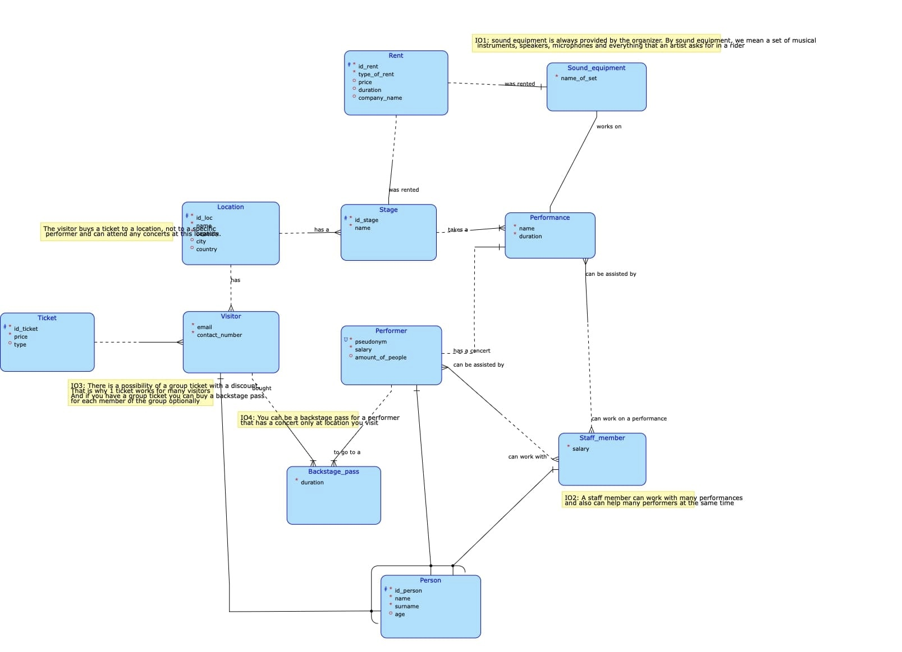

# 🎵 Atlas Weekend Database Project

This project models the **Atlas Weekend Music Festival** — a large-scale event taking place at multiple locations simultaneously.  
The database captures relationships between **performers, visitors, staff members, rentals, locations, and stages**, including optional services such as backstage passes.

---

## 🧩 Entity–Relationship Diagram

---

## 🏗️ Project Overview

The **Atlas Weekend** is a music festival held across several locations.  
Each location has one or more stages, and multiple performers can appear at different stages during the event.  
The system keeps track of all relationships between **performers, staff members, stages, locations, visitors, and tickets**.

---

## 🧱 Entities and Relationships

### 🎪 Location
- Each location has:
    - `id_loc` – unique identifier
    - `name` – location name
    - `city`, `country`
    - `capacity` – maximum number of people
- One location can have **multiple stages**.

---

### 🎤 Stage
- Each stage has:
    - `id_stage` – unique ID
    - `name`
- A stage is **rented** by the organizers (not owned).
- Many **performances** can take place on the same stage sequentially.

---

### 🎶 Performance
- Represents a **concert** taking place on a specific stage.
- Attributes:
    - `id_stage`, `id_loc`, `name`, `duration`, `tickets_sold`
- Linked to:
    - One **performer**
    - One or more **staff members** (organizers)

---

### 👩‍🎤 Performer
- A performer can be:
    - a solo artist
    - a duet
    - a group (with `amount_of_people > 1`)
- Each performer has:
    - `id_person`, `pseudonym`, `salary`
- Performs **once per festival**.
- Requires rented **sound equipment** to perform (lighting and pyrotechnics are excluded from the model).

---

### 👨‍💼 Staff Member
- Responsible for **organizing performances**.
- Attributes:
    - `id_person`, `salary`
- A staff member can:
    - work on several performances
    - assist multiple performers simultaneously

---

### 🎟️ Ticket
- Visitors purchase tickets **to locations**, not to specific performers.
- Each ticket has:
    - `id_ticket`, `price`, `type`
- A single group ticket may be shared among multiple visitors.

---

### 🧑‍🤝‍🧑 Visitor
- Represents anyone attending the festival.
- Attributes:
    - `id_person`, `email`, `contact_number`
- A visitor:
    - buys a ticket to a location
    - may attend any concerts at that location

---

### 🔑 Backstage Pass
- Optional service allowing visitors to go backstage and meet their favorite performer.
- Attributes:
    - `id_pass`, `price`, `duration`
- Linked to:
    - one **visitor**
    - one **performer**

---

### 🧰 Rentals
- The organizers rent:
    - **stages**
    - **sound equipment**
- Each rental has:
    - `id_rent` – unique ID
    - `company_name`
    - `price`, `duration`
- Each rented item (stage or equipment) is associated with the corresponding entity.

---

## 🗄️ Database Scripts

| File | Description |
|------|--------------|
| `create_script.sql` | Creates all database tables and relationships |
| `insert_script.sql` | Populates the database with sample data |
| `sql_queries/` | Contains individual SQL query files (D1–D25) used for data analysis and reporting |

---

## 🧠 Example Queries
- Show stages where no concerts take place
- Find the performer with the highest salary
- List all visitors who bought a backstage pass to *Rihanna*
- Identify staff members who worked with every performer
- Display group tickets with more than two visitors
